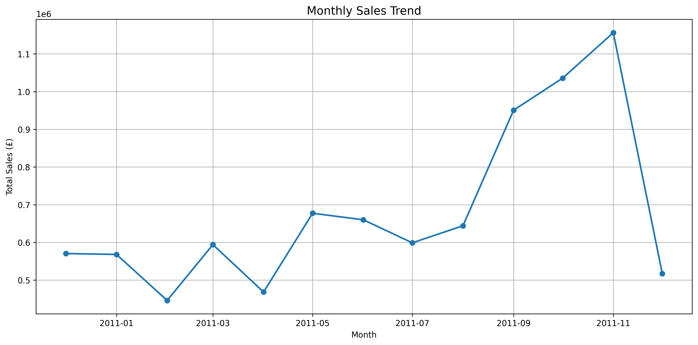
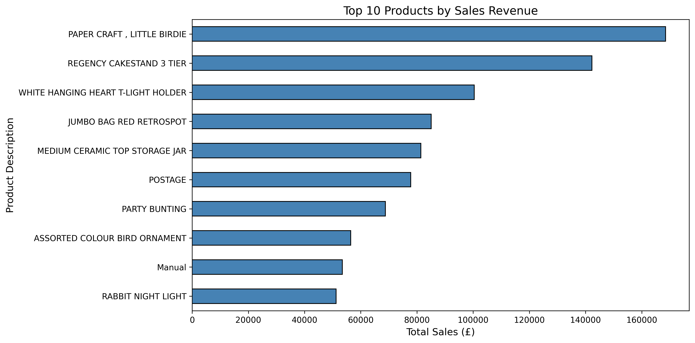
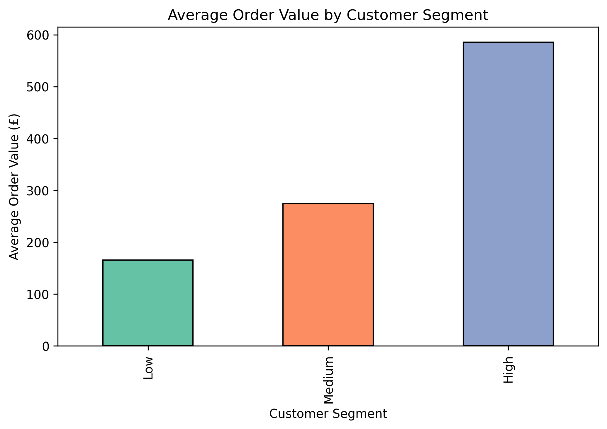
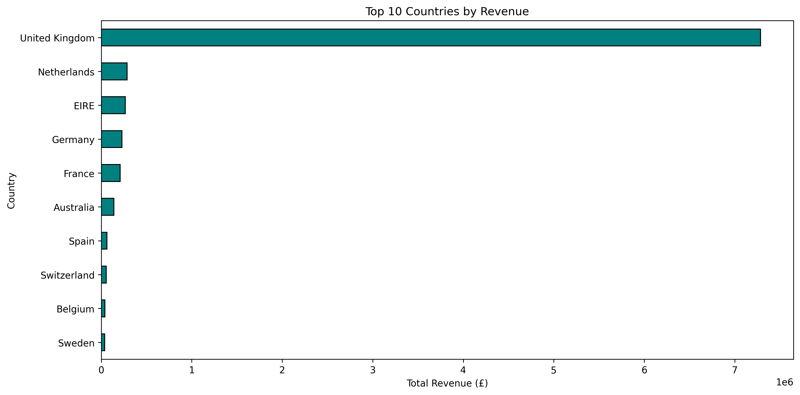
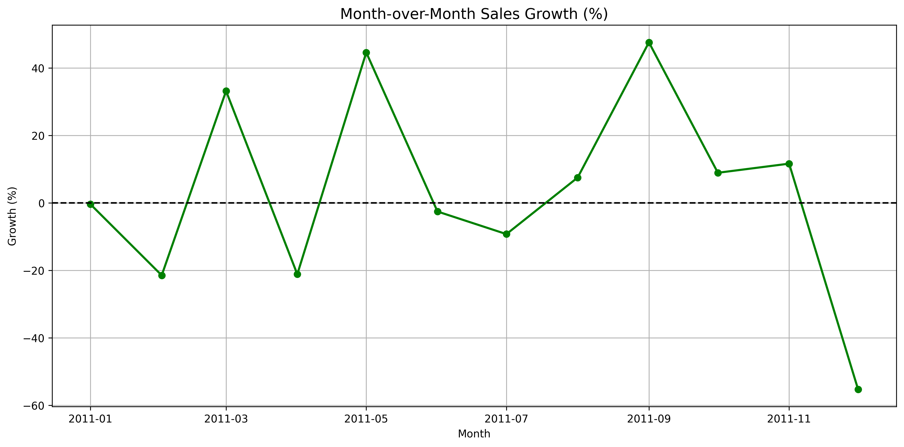
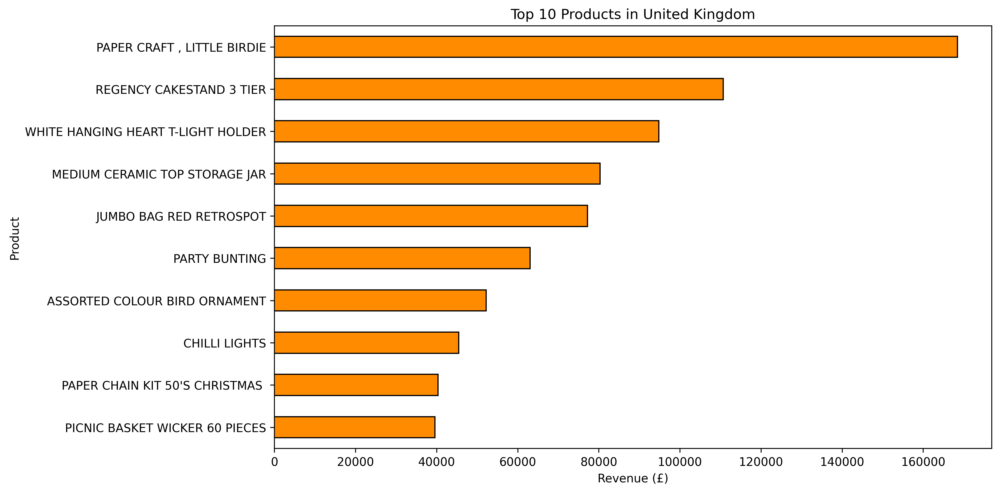

# 🛍️ Online Retail Sales Analysis

## 📌 Project Overview

This project presents an end-to-end **Exploratory Data Analysis (EDA)** of the **Online Retail Dataset** from the UCI Machine Learning Repository. The analysis focuses on customer purchasing behavior, product performance, sales trends, customer segmentation, and country-wise revenue using Python.

---

## 📈 Results Summary

- Processed over **401,000 retail transactions**.
- Analyzed **22,190 invoices**, **4,372 customers**, and **3,684 products**.
- Identified the highest revenue-generating products and customer segments.
- Discovered strong sales growth during **September–November**.
- Found that the **United Kingdom** contributed the majority of revenue.

---

## 📂 Dataset

- **Source:** UCI Machine Learning Repository
- **Dataset:** Online Retail
- **Time Period:** December 2010 – December 2011
- **Transactions after cleaning:** 401,604
- **Unique Customers:** 4,372
- **Unique Products:** 3,684

---

## 🛠️ Technologies Used

- Python
- Pandas
- NumPy
- Matplotlib
- Google Colab

---

## 📊 Project Workflow

- Data Loading
- Data Cleaning
- Missing Value Handling
- Exploratory Data Analysis (EDA)
- Time-Series Sales Analysis
- Customer Segmentation
- Average Order Value (AOV) Analysis
- Country-wise Revenue Analysis
- Product Performance Analysis
- Business Insights & Recommendations

---

## 📈 Key Findings

- The **United Kingdom** generated the highest revenue.
- **November 2011** recorded the highest monthly sales.
- **PAPER CRAFT, LITTLE BIRDIE** was the highest revenue-generating product.
- High-value customers had the highest average order value, making them the most profitable customer segment.

---
## 📊 Visualizations

### 1. Monthly Sales Trend


---

### 2. Top 10 Products by Revenue


---

### 3. Customer Segmentation


---

### 4. Revenue by Country


---

### 5. Month-over-Month Sales Growth


---

### 6. Top Products in United Kingdom

---

## 💼 Business Recommendations

1. Focus marketing campaigns on high-value customers through loyalty programs and personalized promotions.
2. Maintain adequate inventory for top-performing products to prevent stock shortages.
3. Increase inventory planning and marketing efforts before the holiday season, especially from September to November.

---

## 📁 Repository Structure

```text
online-retail-sales-analysis/
│
├── images/
│   ├── country_revenue.png
│   ├── customer_segments.png
│   ├── monthly_sales.png
│   ├── quantity_distribution.png
│   ├── sales_growth.png
│   ├── top_products.png
│   ├── uk_top_products.png
│   └── unitprice_distribution.png
│
├── Online_Retail_Sales_Analysis.ipynb
├── README.md
├── requirements.txt
└── LICENSE
```

## 🚀 How to Run

1. Clone the repository:

```bash
git clone https://github.com/MuhammadWaqasRiaz/online-retail-sales-analysis.git
```

2. Install the required packages:

```bash
pip install -r requirements.txt
```

3. Open the notebook:

```text
Online_Retail_Sales_Analysis.ipynb
```

---

## 📚 Dataset Source

UCI Machine Learning Repository – Online Retail Dataset

https://archive.ics.uci.edu/dataset/352/online+retail

---

## 👨‍💻 Author

**Muhammad Waqas Riaz**

- LinkedIn: https://www.linkedin.com/in/mwaqas5545/
- ResearchGate: https://www.researchgate.net/profile/Muhammad-Riaz-71
